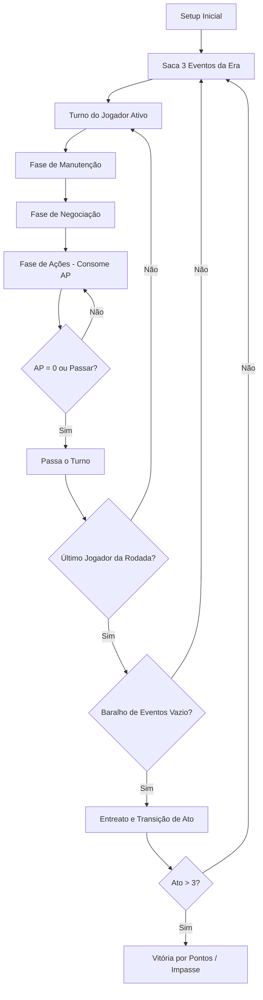
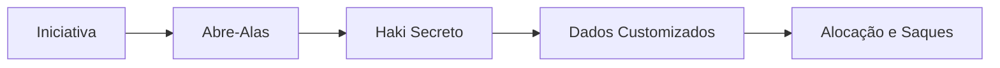

# ESPECIFICAÇÃO DE REQUISITOS DE SISTEMA (SRS)
## Título do Jogo: ONE PIECE - O TRONO VAZIO
**Versão:** 2.0.0 (Produção e Alta Fidelidade)
**Gênero:** Simulação Geopolítica Assimétrica em Campanha
**Inspirações:** *Root* (Assimetria), *COIN Series* (Contrainsurgência), *Arcs* (Legado Orgânico), *Dune* (Combate por Blefe)

---

## 1. INTRODUÇÃO E FILOSOFIA DE DESIGN

Este documento serve como a **Especificação Técnica Oficial** (Design Bible) para o desenvolvimento do protótipo digital de *One Piece: O Trono Vazio*. Ele especifica com precisão matemática e lógica todas as regras de turno, economia de recursos, modelagem de dados, algoritmos de combate, transições de Atos e diretrizes de interface.

O jogo é estruturado em torno da tensão entre a **Hegemonia** (Governo Mundial: Almirante e Cipher-Pol), que busca manter o *status quo* e ocultar os segredos do Século Perdido, e a **Entropia** (Rebeldes: Yonkou, Capitão Pirata e Líder Revolucionário), que buscam liberdade, expansão e revelação do One Piece.

---

## 2. ARQUITETURA DE DADOS E ESTADO GLOBAL

O jogo deve ser implementado usando o padrão MVC (Model-View-Controller). O estado lógico do jogo (`game.js`) deve ser completamente isolado de qualquer elemento visual ou manipulador do DOM (`ui.js`).

### 2.1. Representação do Estado do Jogo (State Model)
O objeto central de estado (`this.state`) deve conter:
* **campanha**:
  - `currentAct`: Inteiro (1, 2 ou 3).
  - `currentRound`: Inteiro (1, 2, ...).
  - `activePlayerIdx`: Inteiro (0 a 4).
  - `actionPoints`: Inteiro (AP restantes do jogador ativo).
  - `shichibukaiPact`: Objeto ou nulo (grava as partes do acordo e status de traição).
* **baralhos**:
  - `eventDeck`: Array de Cartas de Evento da Era ativa.
  - `discardedEvents`: Array de Cartas de Evento descartadas.
  - `activeEvents`: Array contendo os 3 Eventos ativos na rodada atual.
  - `weaponMarket`: Array de tamanho fixo 3 contendo as armas disponíveis para compra.
  - `actionDeck`: Array de Cartas de Ação para compra no Mercado Negro.
* **geografia**:
  - `islands`: Lista de objetos `Island`.
  - `connections`: Lista de objetos `Route`.
* **jogadores**:
  - Lista de objetos `Player` contendo atributos de recursos, mão, ambição e frotas.

### 2.2. Modelagem das Ilhas (Island Node Model)
Cada nó de ilha no mapa deve conter os seguintes campos de dados:
```typescript
interface Island {
    id: number;
    name: string;
    x: number;
    y: number;
    type: "naval" | "final" | "climate" | "nature" | "mystery" | "political";
    revealed: boolean;
    poneglyph: 1 | 2 | 3 | 4 | null; // ID do Road Poneglyph original
    baseStructure: "forte_marinha" | "fortaleza_yonkou" | "base_revolucionaria" | "marineford" | null;
    fleets: Array<FleetUnit>;
    quest: Quest | null;
    isFixed: boolean;
}
```

### 2.3. Modelagem de Unidades (FleetUnit Model)
Todas as unidades no tabuleiro possuem Pontos de Ataque (PA) e Pontos de Vida (PV) dinâmicos durante o combate.
```typescript
interface FleetUnit {
    playerOwnerIdx: number; // 0: Marinha, 1: Yonkou, 2: Pirata, 3: CP, 4: Rev, 5: Neutro
    unitType: "navio_basico" | "navio_guerra" | "navio_capitao" | "navio_comandante" | 
               "lider_almirante" | "lider_yonkou" | "lider_capitao" | "lider_rev" | "lider_cipherpol" | "celula";
    maxPV: number;
    currentPV: number;
    pa: number;
}
```
#### Atributos Físicos de Unidades e Estruturas:
1. **Estruturas Físicas (Imóveis)**:
   - `forte_marinha`: PV 2, PA 0.
   - `fortaleza_yonkou`: PV 4, PA 0.
   - `marineford`: PV 5, PA 0.
2. **Frotas (Móveis)**:
   - `navio_basico`: PA 1, PV 1.
   - `navio_guerra`: PA 2, PV 2.
   - `navio_comandante` (Yonkou): PA 2, PV 2.
   - `navio_capitao` (Nau Principal Pirata): PA 2, PV 3.
3. **Líderes (Tokens Anexáveis)**:
   - `lider_yonkou`: PA 5, PV 5.
   - `lider_almirante`: PA 4, PV 4.
   - `lider_capitao`: PA 3, PV 2.
   - `lider_rev`: PA 3, PV 3.
   - `lider_cipherpol`: PA 3, PV 3.

---

## 3. FLUXO GLOBAL DO JOGO E MÁQUINA DE ESTADO

O protótipo digital executa em um loop contínuo estruturado em torno da rodada e do turno individual de cada jogador.



### 3.1. Fase Global (Início da Rodada)
1. O motor de estados ativa a fase global se `isRoundActive === false`.
2. Saca-se sequencialmente **3 Cartas de Evento** do baralho de Era correspondente ao Ato.
3. Se o baralho contiver menos de 3 cartas, saca-se as restantes e marca-se o flag de "Última rodada do Ato". Se estiver vazio no início, o Entreato é engatilhado.
4. Aplica-se as regras de modificadores de cada evento de forma aditiva.

### 3.2. Fluxo do Turno do Jogador
1. **Fase de Manutenção**:
   - **Compra de Cartas**: O jogador ativo compra 1 Carta de Ação gratuitamente. Se a mão exceder 5 cartas, deve imediatamente descartar o excedente de sua escolha.
   - **Renda Passiva em Berries**: Coleta-se Berries com base nas seguintes fórmulas rígidas:
     - *Almirante*: $1 \text{ (Base)} + N \text{ (Estruturas Navais no mapa)}$.
     - *Yonkou*: $1 \text{ (Base)} + (F \text{ (Fortalezas de Yonkou)} \times 2)$.
     - *Capitão Pirata*: $1 \text{ (Base)} + 1 \text{ (Se realizou Saque na rodada anterior)}$.
     - *Cipher-Pol*: Renda Fixa de $2 \text{ Berries}$ por turno.
     - *Revolucionários*: $1 \text{ (Base)} + \lfloor C \text{ (Células Revolucionárias ativas)} / 2 \rfloor$.
2. **Fase de Negociação (Free-Talk)**:
   - Jogador ativo pode iniciar transações de balcão. Trocas físicas imediatas de Berries, Armas e Rubbings são validadas e travadas de forma automática pelo jogo.
3. **Fase de Ações (AP Manager)**:
   - O jogador executa ações gastando AP até zerar ou declarar passagem voluntária.
   - AP Max por Turno: **Almirante (3 AP)**, **Yonkou (3 AP)**, **Capitão Pirata (4 AP)**, **Cipher-Pol (4 AP)**, **Líder Revolucionário (4 AP)**.

---

## 4. AS AÇÕES E SUAS FÓRMULAS DE VALIDAÇÃO

Todas as ações realizadas no tabuleiro físico exigem validações estritas de estado e custo:

### 4.1. Navegar / Movimentar (Custo: 1 AP)
* **Validação de Rota**: Deve existir uma conexão direta (`Route`) entre a ilha de origem e a de destino.
* **Fricção de Movimento (Custo Logístico)**:
  - Frotas leves (Piratas, CP, Revs) movem frotas sem custo de Berries.
  - Frotas pesadas (Almirante, Yonkou) devem pagar **1 Berry adicional** se estiverem movendo mais de 3 navios simultaneamente.
* **Perigos Climáticos (Hazards)**: Se a rota tiver `hazard === true`, e o jogador ativo não possuir em seu líder ativo a arma "Casco de Madeira Adam" ou "Canhões de Kairouseki", aplica-se **1 de dano automático** a um Navio Básico da frota em movimento. Se o navio tiver PV = 0, ele é destruído e retirado do tabuleiro no trânsito.
* **Neblina de Guerra**: Se o destino for inexplorado (`revealed === false`), o movimento da frota é interrompido imediatamente no destino, revelando a ilha e encerrando a ação.

### 4.2. Recrutar / Fortificar (Custo: 1 AP)
* **Validação de Posicionamento**: O jogador deve ter pelo menos 1 unidade ou estrutura ativa no nó selecionado, ou o nó deve ser sua base natal.
* **Custos de Recrutamento (Berries)**:
  - Navio Básico: 1 Berry.
  - Navio de Guerra / Comandante: 3 Berries.
  - Forte Básico: 4 Berries.
  - Fortaleza de Yonkou: 4 Berries.
  - Posicionar Célula Revolucionária: 1 Berry.

### 4.3. Explorar e Fazer Quest (Custo: 1 AP)
* **Requisito de Classe**: Apenas Yonkou e Capitão Pirata podem iniciar.
* **Validação de Limpeza**: A ilha selecionada não pode conter unidades da Marinha Neutra ou de outras facções hostis no nó.
* **Fórmula do Teste**:
  - O jogador escolhe (opcionalmente) descarregar 1 Carta de Ação da sua mão para somar seu valor de PA.
  - Rola-se 2D6.
  - Calcula-se o Poder Total:
    $$P_{\text{total}} = F_{\text{frota}} + A_{\text{carta}} + (D_1 + D_2)$$
    onde $F_{\text{frota}}$ é a soma de PA de todas as frotas aliadas no nó, e $A_{\text{carta}}$ é o valor de ataque da carta tática jogada.
  - Se $P_{\text{total}} \ge \text{Dificuldade da Quest}$, a quest é bem sucedida.
    * *Recompensa*: Coleta o prêmio listado na ilha (VPs, Berries, ou descobre o Road Poneglyph).
  - Se $P_{\text{total}} < \text{Dificuldade da Quest}$, o teste falha:
    * *Punição*: 1 Navio Básico da frota sofre 1 de dano e afunda.

### 4.4. Ação de Copiar / Rubbing (Custo: 1 AP)
* **Validação**: O jogador deve ter uma frota ativa na ilha que abriga um Road Poneglyph original desvendado.
* **Mecânica**: O jogador consome 1 AP e gera 1 Cópia (Rubbing) em sua área de jogo. Há um teto físico de 5 cartas de cópias por Poneglyph no jogo.

---

## 5. REGRAS DO SISTEMA DE COMBATE

O combate é projetado para ser implacável e estratégico. O fluxo de batalha segue 5 fases obrigatórias:



### 5.1. Determinação da Iniciativa
* O atacante ganha **Iniciativa de Combate** (aplica danos antes de receber o contra-ataque).
* **Exceção de Furtividade**: Se o defensor for Cipher-Pol ou Revolucionário, a iniciativa é invertida. O defensor aplica seu dano primeiro.

### 5.2. Fase 1: Abre-Alas (Armas)
Ambos os lados revelam publicamente até 1 arma equipada ou carta de tática de combate direto da mão. Os bônus são aplicados imediatamente ao pool de força.

### 5.3. Fase 2: Confronto de Haki Secreto (Blefe)
Cada jogador escolhe 1 Carta de Ação de sua mão e a coloca virada para baixo no painel de combate. As cartas são reveladas ao mesmo tempo:
* O valor de PA da carta do atacante é somado ao seu Pool de Batalha.
* O valor de PD da carta do defensor é somado ao seu Pool de Defesa.

### 5.4. Fase 3: Dados Customizados
Cada jogador rola **1 D6 modificado** com as seguintes faces:
* Face 1: `0` (Falha)
* Face 2: `+1 PA`
* Face 3: `+1 PA`
* Face 4: `+1 PD`
* Face 5: `+1 PD`
* Face 6: `★ Crítico` (Concede escolha de +2 PA ou +2 PD ao jogador)

### 5.5. Fase 4: Alocação de Danos
* O jogador com menor iniciativa deve alocar seus Pontos de Defesa (PD) nas unidades que deseja proteger.
* O jogador com a iniciativa distribui seus Pontos de Ataque (PA). Unidades que receberem danos equivalentes aos seus PVs são removidas do mapa.
* Em seguida, as frotas sobreviventes do defensor desferem seu contra-ataque contra o atacante usando os mesmos passos.

### 5.6. Fase 5: Saque por Overkill (Looting)
Se a unidade destruída no combate for uma **Estrutura**, uma **Nau de Capitão** ou **Navio de Comandante**, e o atacante possuir PA excedente (PA total descarregado > PV total da unidade + PD alocado), ele realiza saques do oponente:
* **Fórmula de Saque**: Cada 1 PA de sobra concede o direito de roubar 1 item do perdedor na seguinte prioridade estrita:
  1. *Rubbings (Cópias de Poneglyphs)*
  2. *Cartas de Armas equipadas*
  3. *Cartas de Ação da mão*
  4. *O Poneglyph Original (Se presente)*

---

## 6. AS 11 AMBIÇÕES DETALHADAS (TABELA DE PONTUAÇÃO)

Cada ambição rege especificamente como o jogador adquire VPs ao longo de um Ato:

| Papel | Ambição | Meta VP | Lógica de Pontuação | Consequência (Sucesso) | Consequência (Fracasso) |
| :--- | :--- | :---: | :--- | :--- | :--- |
| **Almirante** | Justiça Absoluta | 5 | +1 VP por estrutura ou líder rebelde destruído. | Injeta "Buster Call" no deck do Ato II/III. | Perda de 2 Berries no orçamento do setup. |
| **Almirante** | Justiça Moral | 4 | +1 VP por quest pirata interceptada/impedida. | Ilhas civis defendem-se sozinhas no Ato seguinte. | Perda de 1 carta de limite máximo de mão. |
| **Almirante** | Justiça Burocrática | 5 | +1 VP por Token de Tributo entregue em Marineford. | Aumenta renda passiva em +2 Berries por rodada. | Custo de navegação aumenta em +1 Berry. |
| **Cipher-Pol** | Égide Sombria | 4 | +2 VP por assassinato de líder; +1 VP por Rubbing roubado. | Poneglyphs originais são bloqueados para leitura rápida. | Perda do status de ocultamento temporário. |
| **Yonkou** | Império de Ferro | 6 | +1 VP passivo por rodada para cada 2 ilhas sob controle. | Intrusos pagam 1 Berry ao entrar em seus feudos. | Perda de 2 ilhas de controle automático. |
| **Yonkou** | Sindicato do Caos | 5 | +1 VP quando outros piratas afundam navios da Marinha. | Armas do mercado aberto ficam 1 Berry mais baratas. | Yonkou não coleta tributos no próximo Ato. |
| **Capitão** | Aventureiro do Amanhecer | 4 | +1 VP por ilha explorada; +2 VP por Quest concluída. | Revela 2 rotas marinhas secretas permanentes. | Dificuldade das Quests aumenta em +1. |
| **Capitão** | Conquistador Implacável | 5 | +1 VP por navio inimigo afundado; +2 VP por Saque de ilha. | Inicia o próximo Ato com +2 frotas básicas. | Marinha inicia caçada ativa contra sua Nau. |
| **Capitão** | Magnata do Submundo | 4 | +1 VP por acumular 10 Berries ou vender Rubbings. | Cria um mercado paralelo permanente em sua base. | Perda de metade de seus Berries no cofre. |
| **Revolucionário** | Chamas da Liberdade | 5 | +2 VP por golpe de estado (células > guarnição inimiga). | Ilhas libertadas não geram tributo para Marinha. | Células ativas são eliminadas passivamente. |
| **Revolucionário** | Guardião dos Segredos | 4 | +1 VP por esconder rubbings na base; +2 VP ao infiltrar bases. | Ganha imunidade total a espionagem da CP. | Perda de 2 células ativas no tabuleiro. |

---

## 7. BALANCEAMENTO E LIMITES ECOLÓGICOS (CATCH-UP)

### 7.1. Custo de Oportunidade e Manutenção
Frotas gigantes exigem manutenção ativa. Se um jogador mantiver mais de 6 frotas ativas no tabuleiro no final da sua manutenção, ele deve pagar **1 Berry por unidade excedente** ao cofre central. Caso não possua saldo, as unidades excedentes de sua escolha são descartadas (afundam por falta de suprimentos).

### 7.2. Mecânica de Retorno (Bônus do Azarão)
Se o Líder de um jogador for destruído em combate:
* O Líder realiza **Respawn** na sua base natal na rodada seguinte.
* O jogador afetado ganha o status de **Azarão** (Underdog):
  - Recebe +2 Berries de compensação de seguro no Respawn.
  - Ganha +1 AP adicional no seu primeiro turno pós-respawn para mitigar o atraso no tabuleiro.

### 7.3. Taxação de Monopólio
Se um jogador possuir mais de 12 Berries em seu cofre durante a Fase Global, qualquer Evento que aplique taxas (ex: "Auditoria Fiscal") cobrará o dobro do valor desse jogador, incentivando a circulação ativa de capital e compras no Mercado Negro.

---

## 8. REQUISITOS DE DESIGN DA INTERFACE (UI/UX)

Para garantir visibilidade excepcional em telas digitais de alta resolução:

### 8.1. Tokens Visuais de Ilhas no SVG
* As ilhas devem conter bordas desenhadas com degradê radial correspondente ao bioma.
* **Glow Efeito (Hover)**: Ao passar o cursor, a ilha selecionada deve disparar uma sombra pulsante utilizando filtros SVG (`feGaussianBlur` stdDeviation de 4px a 8px).
* **Text Halo de Legibilidade**: Todo rótulo de texto sob as ilhas deve ser renderizado da seguinte forma:
  ```css
  .island-label {
      font-family: var(--font-body);
      font-size: 11px;
      font-weight: 800;
      fill: #ffffff;
      stroke: #070a0f;
      stroke-width: 3.5px;
      paint-order: stroke fill;
  }
  ```

### 8.2. Painéis do Console de Ações
* **Contraste de Desabilitação**: Botões de ação desabilitados (`:disabled`) devem possuir opacidade de `0.35`, com fontes em cor cinza contrastante (`hsl(210, 8%, 50%)`) para fácil distinção táctil.
* **Log do Diário de Bordo**: Deve categorizar mensagens por cores funcionais (Vermelho para combate/danos, Verde para transações/acordos, Dourado para eventos globais) em fonte mono-espaçada.
